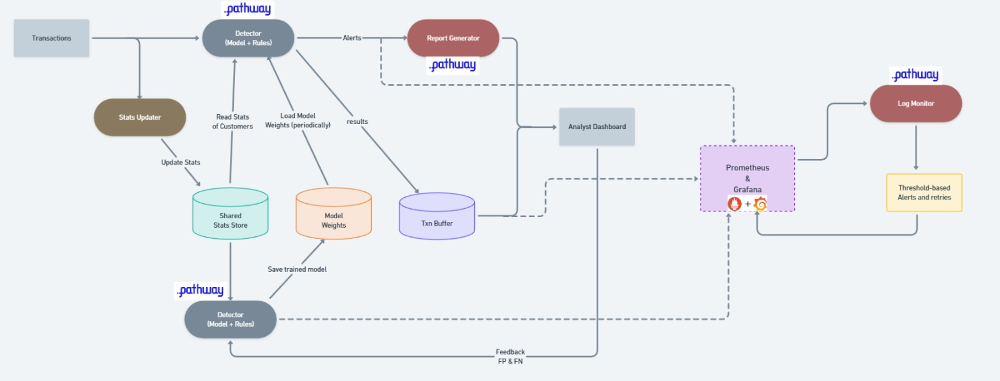

# 🛡️ Real-Time Fraud Detection Pipeline

A **near real-time credit card fraud detection system** built on [Pathway](https://pathway.com/) for stream processing, featuring **online machine learning** with incremental model updates, a **3-tier hybrid detection engine** (rules + ML), **human-in-the-loop feedback**, and a full **observability stack** with Prometheus, Grafana, and latency tracking.

> *Originally developed as part of Inter-IIT Tech Meet 14.0 — Pathway Problem Statement.*

---

## ✨ Key Features

| Feature | Description |
|---|---|
| **Online / Incremental ML** | Uses [River](https://riverml.xyz/) (Hoeffding Adaptive Trees) for continuous model training — the model learns from every new transaction without retraining from scratch |
| **3-Tier Hybrid Detection** | Combines configurable rule-based checks (Tier 1: critical signals, Tier 2: score-based, Tier 3: ML-based) with dual-model ensemble ML scoring |
| **Human-in-the-Loop Feedback** | Fraud analysts review flagged transactions via a web UI; their verdicts are fed back to retrain the model in real time |
| **Real-Time Feature Store (Redis)** | Customer, merchant, and category profiles are maintained in Redis with running statistics (mean, std dev, fraud rate) updated atomically per transaction |
| **End-to-End Latency Tracking** | Millisecond-precision timestamps propagate through every stage (Publisher → Detector → Report) for full pipeline latency visibility |
| **Prometheus + Grafana Monitoring** | 6-panel Grafana dashboard tracking pipeline latency, model F1/precision/recall, alert rates, training progress, and model weight drift |
| **False Negative Detection** | A dedicated collector stores transactions the system marked "legitimate" for human review — catching missed frauds |
| **Auto-Restart on High Latency** | A latency monitor queries Prometheus and auto-restarts all pipeline components if p50 latency exceeds a configurable threshold |

---

## 🏗️ Architecture



The pipeline consists of **6 concurrent processes** communicating over NATS topics:

```
                           ┌──────────────────────┐
                           │   fraudTrain.csv      │
                           │   (Kaggle Dataset)    │
                           └──────┬───────┬────────┘
                                  │       │
                    ┌─────────────┘       └──────────────┐
                    ▼                                    ▼
          ┌─────────────────┐                 ┌──────────────────┐
          │  Detector Pub   │                 │  Feedback Pub    │
          │ (no is_fraud)   │                 │ (with is_fraud)  │
          └────────┬────────┘                 └────────┬─────────┘
                   │ NATS: fraud.transactions          │ NATS: fraud.feedback
                   ▼                                   ▼
          ┌─────────────────┐                 ┌──────────────────┐
          │    Detector      │                 │  Feedback Writer │
          │  (ML + Rules)    │◄── model ──────│  (Online Trainer)│
          │                  │── reads ──────►│                  │
          └───┬──────┬───────┘    Redis       └──────────────────┘
              │      │                              │  │
    all results   alerts only                  updates stats
              │      │                              │  │
              ▼      ▼                              ▼  ▼
     ┌────────┐ ┌───────────┐              ┌──────────────┐
     │Negative│ │  Report   │              │    Redis      │
     │Collect.│ │ Generator │              │ Feature Store │
     └────────┘ │  (PDFs)   │              └──────────────┘
                └─────┬─────┘
                      │
                      ▼
              ┌──────────────┐        ┌───────────────────┐
              │ fraud_reports│        │  Prometheus +      │
              │   (PDFs)     │        │  Grafana Dashboard │
              └──────┬───────┘        └───────────────────┘
                     │
                     ▼
             ┌──────────────┐
             │   Frontend   │
             │ (FastAPI UI) │
             │ :8000        │
             └──────────────┘
```

### Data Flow Summary

1. **Publisher** reads `fraudTrain.csv` and streams transactions to two NATS topics simultaneously:
   - `fraud.transactions` — transactions **without** the `is_fraud` label (simulating real-world detection)
   - `fraud.feedback` — transactions **with** the `is_fraud` label (ground truth for training)
2. **Detector** consumes from `fraud.transactions`, enriches each transaction with Redis-stored customer/merchant/category profiles, runs it through the 3-tier detection engine, and publishes results to `fraud.results` and alerts to `fraud.alerts`
3. **Report Generator** subscribes to `fraud.alerts` and generates bank-grade PDF investigation reports with decoded indicators, risk assessments, and investigation protocols
4. **Feedback Writer** consumes from `fraud.feedback` and incrementally trains two River ML models (Hoeffding Adaptive Tree + StandardScaler pipeline and a standalone validator), while updating Redis stats atomically
5. **Frontend** (FastAPI) serves a web UI for fraud analysts to review PDF reports, confirm/reject fraud, and review potential false negatives
6. **Negative Collector** (optional) stores non-alert transactions for false negative review

---

## 🛠️ Tech Stack

| Layer | Technology | Purpose |
|---|---|---|
| Stream Processing | [Pathway](https://pathway.com/) | Real-time data processing engine with persistence and checkpointing |
| Messaging | [NATS](https://nats.io/) (JetStream) | High-performance pub/sub message broker between pipeline components |
| Machine Learning | [River](https://riverml.xyz/) | Online/incremental ML — `HoeffdingAdaptiveTreeClassifier` with `StandardScaler` pipeline |
| Feature Store | [Redis](https://redis.io/) | In-memory store for customer profiles, merchant stats, and category risk scores |
| Monitoring | [Prometheus](https://prometheus.io/) + [Grafana](https://grafana.com/) | Metrics collection, alerting, and 6-panel real-time dashboard |
| Report Generation | [ReportLab](https://www.reportlab.com/) | Professional PDF fraud investigation reports |
| Frontend | [FastAPI](https://fastapi.tiangolo.com/) | Human review web interface with Tailwind CSS |
| Language | Python 3.11 | All components |
| Containerization | Docker + Docker Compose | Redis, NATS, Prometheus, and Grafana services |

---

## 📁 Project Structure

```
Fraud-Detection-Pipeline/
│
├── publisher/                      # Transaction stream publishers
│   ├── pub_common.py               # Combined publisher (detector + feedback streams)
│   ├── pub_det.py                  # Standalone detector publisher (with latency timestamps)
│   ├── pub_feed.py                 # Standalone feedback publisher (with is_fraud labels)
│   └── common/                     # Publisher utilities
│
├── detector/                       # Fraud detection engine
│   ├── detector_ronly.py           # Main detector — ML inference + 3-tier rule evaluation
│   └── detector_stats_upd.py      # Stats updater node (subscribes to fraud.results)
│
├── feedback/                       # Online model training
│   └── feedback_writer.py          # Incremental trainer — learns from ground truth labels
│
├── report/                         # PDF report generation
│   └── pathway_nats_report.py      # Bank-grade PDF fraud reports with indicator decoding
│
├── frontend/                       # Human review interface
│   └── main.py                     # FastAPI app — fraud alert queue + false negative review
│
├── shared/                         # Shared modules across all components
│   ├── schema.py                   # Pathway schemas (TransactionSchema, FeedBackSchema)
│   ├── model_store.py              # Thread-safe model save/load (pickle, atomic writes)
│   ├── stats_store.py              # File-based stats store (used by pretrain.py)
│   ├── redis_stats_store.py        # Redis-based stats store (used at runtime)
│   ├── rules_loader.py             # JSON-driven fraud rules engine (3-tier evaluation)
│   ├── fraud_rules.json            # Configurable detection rules, thresholds, and protocols
│   └── metrics.py                  # Prometheus metrics — latency, alerts, F1, model weight delta
│
├── monitoring/                     # Observability configuration
│   ├── prometheus.yml              # Prometheus scrape targets (4 pipeline components)
│   └── grafana/                    # Grafana provisioning and dashboard JSON
│       ├── provisioning/           # Auto-provisioned datasources
│       └── dashboards/             # Pre-built 6-panel dashboard
│
├── tests/                          # Testing utilities
│   └── inject_frauds.py            # Comprehensive fraud pattern injector (30+ patterns)
│
├── pathway_persistence/            # Runtime data (gitignored except pre-trained model)
│   ├── ml_models.pkl               # Pre-trained River ML models
│   ├── stats_store.json            # Pre-computed customer/merchant/category stats
│   └── checkpoints_*/              # Pathway checkpoints (auto-generated)
│
├── fraud_reports/                  # Generated PDF reports (created at runtime)
│
├── pretrain.py                     # One-time pre-training script (balanced sampling)
├── redis_manager.py                # Redis CLI tool (load/clear/export/inspect stats)
├── health_check.py                 # System diagnostics (model, stats, NATS checks)
├── latency_monitor.py              # Auto-restart monitor (queries Prometheus for latency)
├── negative_collector.py           # Stores non-alert transactions for false negative review
│
├── run_detector.py                 # Entry point: starts the detector
├── run_report.py                   # Entry point: starts the report generator
├── run_feedback.py                 # Entry point: starts the feedback writer/trainer
├── run_stats_updater.py            # Entry point: starts the stats updater
├── run_negative_collector.py       # Entry point: starts the negative collector
│
├── clean.sh                        # Cleanup script (checkpoints, temp files, reports)
├── Dockerfile                      # Container definition for the pipeline
├── docker-compose.yml              # Base compose (app only)
├── docker-compose-monitoring.yml   # Full stack: Redis + NATS + Prometheus + Grafana
├── requirements.txt                # Python dependencies
└── .github/workflows/ci-cd.yml     # GitHub Actions CI/CD pipeline
```

---

## 🚀 Getting Started

### Prerequisites

- **Python 3.11+**
- **Docker** and **Docker Compose** (for Redis, NATS, Prometheus, Grafana)
- **Dataset**: Download `fraudTrain.csv` from [Kaggle — Fraud Detection](https://www.kaggle.com/datasets/kartik2112/fraud-detection?resource=download&select=fraudTrain.csv) and place it in the project root

### 1. Install Dependencies

```bash
pip install -r requirements.txt
```

### 2. Pre-Train the Model (First Time Only)

This creates initial ML models and computes baseline customer/merchant/category statistics from a balanced sample of the dataset (~3K fraud + ~9K legitimate transactions):

```bash
python pretrain.py
```

> **What it does**: Trains two River Hoeffding Adaptive Tree classifiers on a balanced subsample, saves models to `pathway_persistence/ml_models.pkl`, and writes initial stats to `pathway_persistence/stats_store.json`.

### 3. Start the Infrastructure (Docker)

```bash
# Stop any existing containers and reset data
docker-compose -f docker-compose-monitoring.yml down
docker volume rm fraud-detection-pipeline_prometheus-data 2>/dev/null
docker volume rm fraud-detection-pipeline_grafana-data 2>/dev/null

# Start fresh (Redis, NATS, Prometheus, Grafana)
docker-compose -f docker-compose-monitoring.yml up -d
```

This starts:
| Service | Port | Purpose |
|---|---|---|
| Redis | `6379` | Feature store |
| NATS | `4222` (client), `8222` (monitoring) | Message broker |
| Prometheus | `9090` | Metrics collection |
| Grafana | `3000` (login: `admin`/`admin`) | Dashboard |

### 4. Clean Previous Run Data

```bash
./clean.sh
```

### 5. Load Stats into Redis

```bash
python redis_manager.py load
```

### 6. Start Pipeline Components

Start each in a **separate terminal**:

```bash
# Terminal 1: Fraud Detector
python run_detector.py

# Terminal 2: Report Generator
python run_report.py

# Terminal 3: Stats Updater
python run_stats_updater.py

# Terminal 4: Feedback Writer (online model trainer)
python run_feedback.py

# Terminal 5: Transaction Publisher (starts both detector + feedback streams)
python publisher/pub_common.py
```

### 7. Start the Frontend

```bash
python frontend/main.py
```

Open **http://localhost:8000** — the Fraud Investigation Center.

### 8. Access Grafana Dashboard

Open **http://localhost:3000** (login: `admin` / `admin`)

---

## 🔬 How It Works

### Detection Engine: 3-Tier Hybrid Approach

All detection rules are **externally configurable** via [`shared/fraud_rules.json`](shared/fraud_rules.json):

#### Tier 1 — Absolute Certainty (Confidence: 95%)
Triggers on **extreme signals** — any 2+ of:
- `MASSIVE_AMT`: Z-score > 4.5 standard deviations above customer average
- `EXTREME_DIST`: Transaction 4+ std devs from home location
- `FRAUD_MERCHANT`: Merchant with 40%+ historical fraud rate (50+ transactions)
- `FRAUD_HISTORY`: Customer with 3+ confirmed prior fraud incidents

Also triggers on 1 extreme signal + high ML confidence (≥ 80%).

#### Tier 2 — Strong Evidence (Confidence: 80%)
**Score-based** detection — accumulates points from multiple signals and triggers at 75+ points:
- `VeryHighAmt` (40 pts), `HighAmt` (30 pts)
- `VeryFar` (35 pts), `Far` (25 pts)
- `RiskyMerch` (35 pts), `LateOnline` (25 pts)
- `PrevFraud` (30 pts), `Amt+Dist` combo (25 pts)
- `ML_high` ≥80% (25 pts), `ML_medium` ≥70% (15 pts)

#### Tier 3 — ML-Based Detection (Confidence: 75%)
Triggers when ML score ≥ 82% **and** 2+ supporting behavioral anomalies (amount, distance, merchant risk, category risk, or fraud history).

### Online Machine Learning

The model uses a **dual-model ensemble**:

1. **Primary**: `StandardScaler → HoeffdingAdaptiveTreeClassifier` (grace_period=200, delta=1e-5)
2. **Validator**: Standalone `HoeffdingAdaptiveTreeClassifier` (grace_period=150, delta=1e-4)

The final ML score is the average of both models' fraud probabilities × 100.

**Feature vector** (12 features):
| Feature | Description |
|---|---|
| `amt` | Raw transaction amount |
| `z_amt` | Z-score of amount vs customer average |
| `amt_ratio` | Amount / customer average amount |
| `dist` | Haversine distance between customer and merchant (km) |
| `z_dist` | Z-score of distance vs customer average |
| `hr` | Hour of transaction |
| `merch_risk` | Merchant's historical fraud rate |
| `cat_risk` | Category's historical fraud rate |
| `online` | 1 if online category (`shopping_net`, `misc_net`, `grocery_net`) |
| `late_night` | 1 if between 1–5 AM |
| `fraud_history` | Customer's prior confirmed fraud count |
| `n` | Customer's total transaction count (capped at 1000) |

### Redis Feature Store

Customer, merchant, and category profiles are maintained in Redis using atomic pipeline operations:

- **Customers**: Running mean, std deviation (via Welford's online algorithm), fraud history, transaction count
- **Merchants**: Total transactions, fraud count, fraud rate (computed after 30+ transactions)
- **Categories**: Total transactions, fraud count, fraud rate (computed after 100+ transactions)

### PDF Report Generation

Each fraud alert generates a multi-page investigation PDF containing:
- Risk score and severity assessment
- Decoded fraud indicators with severity levels (CRITICAL / HIGH / MEDIUM)
- Full transaction details (masked card number)
- Detection methodology and tier explanation
- Investigation protocol (immediate and short-term actions)
- Customer verification questions (templated with transaction details)
- Risk mitigation strategies
- Case disposition guidance
- Legal disclaimer

Reports are saved with companion JSON files for frontend parsing.

---

## 📊 Monitoring & Observability

### Prometheus Metrics

Each pipeline component exposes metrics on its own port:

| Component | Port | Key Metrics |
|---|---|---|
| Detector | `8001` | `fraud_pipeline_latency_seconds`, `fraud_alerts_total`, `fraud_latency_seconds` |
| Stats Updater | `8002` | Internal processing metrics |
| Feedback Writer | `8003` | `fraud_model_f1_score`, `fraud_model_precision`, `fraud_model_recall`, `fraud_model_training_samples_total`, `fraud_model_weight_delta` |
| Report Generator | `8004` | `fraud_pipeline_latency_seconds` (detector→report, publisher→report end-to-end) |

### Grafana Dashboard

The pre-provisioned Grafana dashboard includes 6 panels:
- **Pipeline Latency** (publisher→detector, detector→report)
- **Alert Rate** by tier and pattern
- **Model Performance** (F1, Precision, Recall over time)
- **Training Progress** (fraud vs legitimate samples)
- **Model Weight Delta** (convergence tracking)
- **1-Minute Weighted Moving Averages** (exponential decay, 15s half-life)

### Latency Monitor (Auto-Restart)

```bash
python latency_monitor.py
```

Queries Prometheus every 5 seconds for p50 latency. If `detector_to_report` latency exceeds **10 seconds**, it automatically:
1. Kills all pipeline processes
2. Restarts them in order
3. Waits 60s before resuming checks
4. Enforces a 2-minute cooldown between restarts

---

## 🖥️ Frontend — Fraud Investigation Center

### Features

- **Fraud Alerts Tab**: Queue of 10 diverse fraud reports (unique indicator patterns prioritized), review and mark as Fraud/Legitimate
- **False Negative Review Tab**: Browse transactions the system marked "legitimate" — catch missed frauds
- **Grafana Link**: One-click access to the monitoring dashboard
- **Auto-Refresh**: Queue updates every 5 seconds
- **PDF Viewer**: Direct access to full investigation reports

### API Endpoints

| Endpoint | Method | Description |
|---|---|---|
| `/` | GET | Main HTML interface |
| `/api/queue` | GET | Get diverse queue of reports with stats |
| `/api/report/{filename}` | GET | Get detailed report data |
| `/api/pdf/{filename}` | GET | Serve PDF file |
| `/api/feedback` | POST | Submit fraud/legitimate verdict |
| `/api/negatives` | GET | Get false negative transactions |
| `/api/negative-feedback` | POST | Mark a negative as fraud |
| `/api/refresh` | POST | Force rescan of reports directory |

---

## 🧪 Testing

### Fraud Pattern Injector

The project includes a comprehensive fraud injection test suite (`tests/inject_frauds.py`) with **30+ fraud patterns**:

```bash
python tests/inject_frauds.py
```

**Pattern categories covered**:
- **Velocity/Burst**: `EXTREME_BURST`, `MAJOR_BURST`, `BURST`, `FastBurst`, `Rapid`
- **Amount Anomalies**: `MASSIVE_AMT`, `HUGE_AMT`, `VeryHighAmt`, `HighAmt`, `UnusualAmt`
- **Distance/Location**: `EXTREME_DIST`, `VERY_FAR`, `VeryFar`, `Far`, `UnusualDist`
- **Merchant Risk**: `FRAUD_MERCHANT`, `BAD_MERCHANT`, `RiskyMerch`
- **Combinations**: `Amt+Dist`, `Burst+Amt`, `NewMerch+High`, `RareCat+High`, `LateOnline`
- **History**: `FRAUD_HISTORY`, `REPEAT_FRAUD`, `PrevFraud`
- **ML Detection**: Complex anomaly patterns

The injector monitors the `fraud_reports/` directory for generated PDFs, validates detection, measures injection-to-detection latency, and produces a full coverage report.

### Health Check

```bash
python health_check.py
```

Validates:
- Model file existence and loadability
- Stats file integrity
- Test predictions from both models
- NATS connectivity
- Actionable recommendations for common issues

---

## ⚡ Quick Restart (After Stopping Pipeline)

```bash
# 1. Stop containers and reset Prometheus data
docker-compose -f docker-compose-monitoring.yml down
docker volume rm fraud-detection-pipeline_prometheus-data 2>/dev/null

# 2. Restart containers
docker-compose -f docker-compose-monitoring.yml up -d

# 3. Clean checkpoints and temp files
./clean.sh

# 4. Reload Redis stats
python redis_manager.py load

# 5. Start all components again (each in separate terminal)
python run_detector.py
python run_report.py
python run_stats_updater.py
python run_feedback.py
python publisher/pub_common.py
python frontend/main.py
```

---

## 🔧 Useful Commands

```bash
# Redis management
python redis_manager.py stats              # Show Redis stats summary
python redis_manager.py export             # Export Redis data to JSON
python redis_manager.py inspect <CC_NUM>   # Inspect a specific customer profile
python redis_manager.py clear              # Clear all Redis data (with confirmation)

# Diagnostics
python health_check.py                     # Full system health check
python verify_model.py                     # Verify model predictions

# Process management
lsof -ti:8000 | xargs kill -9             # Free up frontend port
lsof -ti:8001 | xargs kill -9             # Free up detector metrics port
```

---

## 📊 Dataset

This pipeline uses the **Simulated Credit Card Transaction Dataset** from Kaggle:

🔗 [kaggle.com/datasets/kartik2112/fraud-detection](https://www.kaggle.com/datasets/kartik2112/fraud-detection?resource=download&select=fraudTrain.csv)

- **~1.3M transactions** with 23 features
- Binary `is_fraud` label
- Class distribution: ~0.58% fraud (highly imbalanced)
- Features: transaction amount, merchant, category, location (lat/long), timestamp, customer demographics

Place `fraudTrain.csv` in the project root before running.

---

## 🏛️ NATS Topics

| Topic | Producer | Consumer | Payload |
|---|---|---|---|
| `fraud.transactions` | Publisher | Detector | Transaction JSON (no `is_fraud`) |
| `fraud.feedback` | Publisher | Feedback Writer | Transaction JSON (with `is_fraud`) |
| `fraud.results` | Detector | Negative Collector, Stats Updater | Detection result JSON (all transactions) |
| `fraud.alerts` | Detector | Report Generator | Alert JSON (fraud alerts only) |
| `fraud.reports` | Report Generator | — | Report metadata JSON |